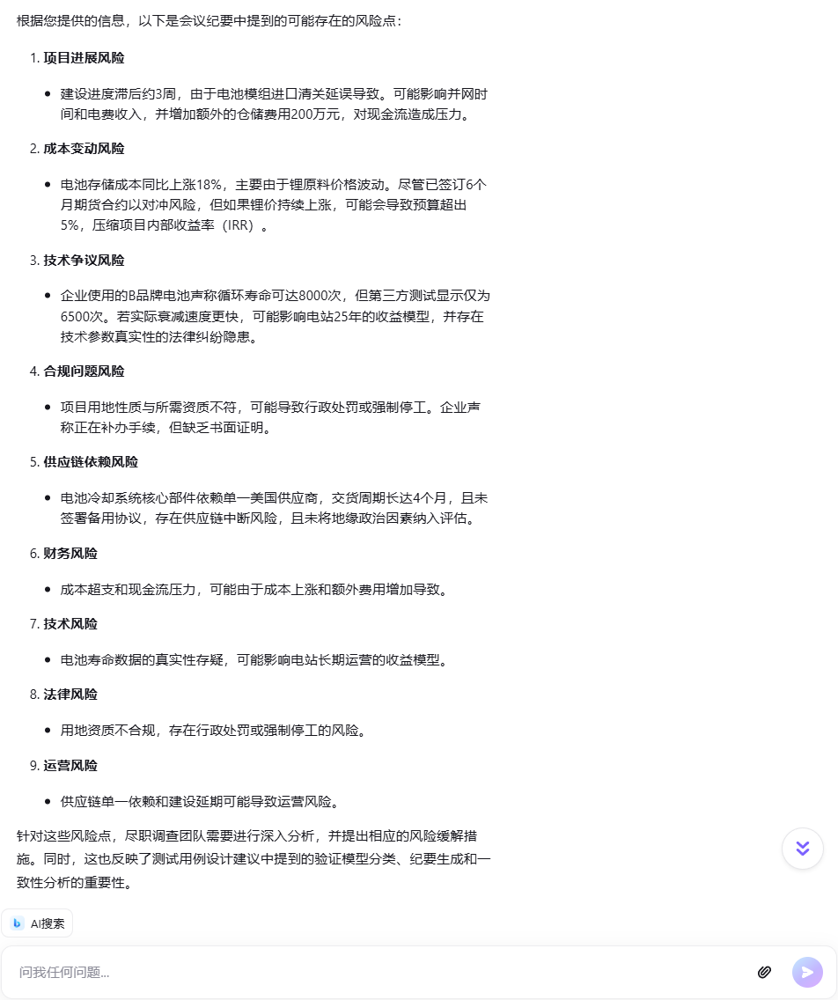

# Assignment 1

## Question 1

### Supervised Learning

**Definition:** Supervised learning involves training a model on a labeled dataset, where each input example is paired with the correct output (target). The model learns to map inputs to outputs by minimizing prediction errors.

**Key Characteristics:**

* Requires labeled data (input-output pairs).
* Used for predictive tasks (classification, regression).
* Evaluated using metrics like accuracy, precision, recall, or mean squared error (MSE).

**Representative Algorithms:**

* **Linear Regression**: Predicts continuous values by fitting a linear relationship between input features and the target variable.
* **Decision Trees**: A tree-based model that splits data into branches to make classification or regression decisions.

### Unsupervised Learning

**Definition:** Unsupervised learning works with unlabeled data, where the model tries to find hidden patterns, groupings, or structures without explicit guidance.

**Key Characteristics:**

* No labeled outputs; the model explores data on its own.
* Used for exploratory analysis (clustering, dimensionality reduction).
* Evaluated using intrinsic measures (e.g., silhouette score for clustering).

**Representative Algorithms:**

* **K-Means Clustering**: Groups data into k clusters based on similarity (distance metric).
* **Principal Component Analysis (PCA)**: Reduces dimensionality by transforming data into a set of orthogonal components.

## Question 2

### Calculating Linear Regression Parameters

For a simple linear regression $ y = wx + b $, the parameters $ w $ (slope) and $ b $ (intercept) are calculated using:

$$
w = \frac{n(\sum xy) - (\sum x)(\sum y)}{n(\sum x^2) - (\sum x)^2}
$$

$$
b = \frac{\sum y - w \sum x}{n}
$$

### Performing Each Iteration

#### Iteration 1: Leave out $(0, 2)$, train on $\{(2, 2), (3, 1)\}$

Training set:

$$
x: 2, 3 \quad y: 2, 1
$$

Calculations:

$$
\sum x = 5, \quad \sum y = 3, \quad \sum xy = 7, \quad \sum x^2 = 13, \quad n = 2
$$

$$
w = \frac{2 \times 7 - 5 \times 3}{2 \times 13 - 5^2} = \frac{14 - 15}{26 - 25} = -1
$$

$$
b = \frac{3 - (-1) \times 5}{2} = 4
$$

Model: $ y = -x + 4 $

Test on $(0, 2)$:

$$
\hat{y} = 4, \quad \text{Squared Error} = (4 - 2)^2 = 4
$$

#### Iteration 2: Leave out $(2, 2)$, train on $\{(0, 2), (3, 1)\}$

Training set:

$$
x: 0, 3 \quad y: 2, 1
$$

Calculations:

$$
\sum x = 3, \quad \sum y = 3, \quad \sum xy = 3, \quad \sum x^2 = 9, \quad n = 2
$$

$$
w = \frac{2 \times 3 - 3 \times 3}{2 \times 9 - 3^2} = -\frac{1}{3}
$$

$$
b = \frac{3 - (-\frac{1}{3}) \times 3}{2} = 2
$$

Model: $ y = -\frac{1}{3}x + 2 $

Test on $(2, 2)$:

$$
\hat{y} = \frac{4}{3}, \quad \text{Squared Error} = \left(\frac{4}{3} - 2\right)^2 = \frac{4}{9}
$$

#### Iteration 3: Leave out $(3, 1)$, train on $\{(0, 2), (2, 2)\}$

Training set:

$$
x: 0, 2 \quad y: 2, 2
$$

Calculations:

$$
\sum x = 2, \quad \sum y = 4, \quad \sum xy = 4, \quad \sum x^2 = 4, \quad n = 2
$$

$$
w = \frac{2 \times 4 - 2 \times 4}{2 \times 4 - 2^2} = 0
$$

$$
b = \frac{4 - 0 \times 2}{2} = 2
$$

Model: $ y = 2 $

Test on $(3, 1)$:

$$
\hat{y} = 2, \quad \text{Squared Error} = (2 - 1)^2 = 1
$$

### Calculating the Mean Squared Error (MSE)

Squared Errors:

$$
4, \quad \frac{4}{9}, \quad 1
$$

$$
MSE = \frac{4 + \frac{4}{9} + 1}{3} = \frac{\frac{49}{9}}{3} = \frac{49}{27} \approx 1.8148
$$

### Final Answer

The mean squared error obtained using Leave-One-Out cross-validation is:

$$
MSE = \dfrac{49}{27} \approx 1.8148
$$

## Question 3

### Calculate Absolute Errors and Squared Errors

| Month | AD | FD | Absolute Error $ \|AD - FD\| $ | Squared Error $ (AD - FD)^2 $ |
| :---: | :---: | :---: | :---: | :---: |
| 1 | 42 | 44 | 2 | 4 |
| 2 | 45 | 46 | 1 | 1 |
| 3 | 49 | 48 | 1 | 1 |
| 4 | 55 | 50 | 5 | 25 |
| 5 | 57 | 55 | 2 | 4 |
| 6 | 60 | 60 | 0 | 0 |
| 7 | 62 | 64 | 2 | 4 |
| 8 | 58 | 60 | 2 | 4 |
| 9 | 54 | 53 | 1 | 1 |
| 10 | 50 | 48 | 2 | 4 |
| 11 | 44 | 42 | 2 | 4 |
| 12 | 40 | 38 | 2 | 4 |

### Sum the Errors

**Sum of Absolute Errors:**

$ 2 + 1 + 1 + 5 + 2 + 0 + 2 + 2 + 1 + 2 + 2 + 2 = 22 $

**Sum of Squared Errors:**

$ 4 + 1 + 1 + 25 + 4 + 0 + 4 + 4 + 1 + 4 + 4 + 4 = 56 $

### Calculate MAE and MSE

**Mean Absolute Error (MAE):**

$$
\text{MAE} = \frac{\text{Sum of Absolute Errors}}{\text{Number of Months}} = \frac{22}{12} \approx 1.83
$$

**Mean Squared Error (MSE):**

$$
\text{MSE} = \frac{\text{Sum of Squared Errors}}{\text{Number of Months}} = \frac{56}{12} \approx 4.67
$$

### Final Results

$$
\text{MAE} = \frac{22}{12} \approx 1.83 \quad \text{MSE} = \frac{56}{12} \approx 4.67
$$

## Question 4

### Calculate Precision and Recall for Each Class

#### Definitions

**Precision**: For a given class, the proportion of predicted instances that are actually correct.

$$
\text{Precision}_i = \frac{TP_i}{TP_i + FP_i}
$$

**Recall**: For a given class, the proportion of actual instances that are correctly predicted.

$$
\text{Recall}_i = \frac{TP_i}{TP_i + FN_i}
$$

#### Confusion Matrix

$$
\begin{array}{|c|c|c|c|}
\hline
\text{Actual/Predicted} & A & B & C \\
\hline
A & 40 & 20 & 10 \\
B & 35 & 85 & 40 \\
C & 0 & 10 & 20 \\
\hline
\end{array}
$$

#### Calculations

##### Class A

* $ TP_A = 40 $
* $ FP_A = 35 + 0 = 35 $
* $ FN_A = 20 + 10 = 30 $

$$
\text{Precision}_A = \frac{40}{40 + 35} = \frac{40}{75} \approx 0.5333
$$

$$
\text{Recall}_A = \frac{40}{40 + 30} = \frac{40}{70} \approx 0.5714
$$

##### Class B

* $ TP_B = 85 $
* $ FP_B = 20 + 10 = 30 $
* $ FN_B = 35 + 40 = 75 $

$$
\text{Precision}_B = \frac{85}{85 + 30} = \frac{85}{115} \approx 0.7391
$$

$$
\text{Recall}_B = \frac{85}{85 + 75} = \frac{85}{160} \approx 0.5312
$$

##### Class C

* $ TP_C = 20 $
* $ FP_C = 10 + 40 = 50 $
* $ FN_C = 0 + 10 = 10 $

$$
\text{Precision}_C = \frac{20}{20 + 50} = \frac{20}{70} \approx 0.2857
$$

$$
\text{Recall}_C = \frac{20}{20 + 10} = \frac{20}{30} \approx 0.6667
$$

#### Results

**Class A:**

* Precision $ \approx 0.5333 $
* Recall $ \approx 0.5714 $

**Class B:**

* Precision $ \approx 0.7391 $
* Recall $ \approx 0.5312 $

**Class C:**

* Precision $ \approx 0.2857 $
* Recall $ \approx 0.6667 $

### Macro-average and Weighted-average Precision and Recall

#### Macro-average

$$
\text{Macro-Precision} = \frac{\text{Precision}_A + \text{Precision}_B + \text{Precision}_C}{3} \approx \frac{0.5333 + 0.7391 + 0.2857}{3} \approx 0.5194
$$

$$
\text{Macro-Recall} = \frac{\text{Recall}_A + \text{Recall}_B + \text{Recall}_C}{3} \approx \frac{0.5714 + 0.5312 + 0.6667}{3} \approx 0.5898
$$

#### Weighted-average

Calculate actual class counts:

$$
\text{Actual}_A = 70, \quad \text{Actual}_B = 160, \quad \text{Actual}_C = 30, \quad \text{Total} = 260
$$

$$
\text{Weighted-Precision} = \frac{0.5333 \times 70 + 0.7391 \times 160 + 0.2857 \times 30}{260} \approx \frac{37.331 + 118.256 + 8.571}{260} \approx 0.6314
$$

$$
\text{Weighted-Recall} = \frac{0.5714 \times 70 + 0.5312 \times 160 + 0.6667 \times 30}{260} \approx \frac{39.998 + 84.992 + 20.001}{260} \approx 0.5577
$$

#### Results

**Macro-average:**

* Precision $ \approx 0.5194 $
* Recall $ \approx 0.5898 $

**Weighted-average:**

* Precision $ \approx 0.6314 $
* Recall $ \approx 0.5577 $

## Question 5

### Background

From July to August 2024, I served as an intern in the Information Technology Department at Changjiang Pension Insurance Co., Ltd., a subsidiary of Pacific Insurance Group. I was fully involved in the development and construction of the Due Diligence Assistant. The Due Diligence Assistant is a self-developed product of my internship company, targeting the internal due diligence team. **Based on Dify, I built an AI Agent, similar to the task requirements of this assignment. I replicated this project on the Tongji University AI Application Innovation Platform.**

### Key Functionalities

The Due Diligence Assistant is an in-house AI-powered tool developed by Changjiang Pension Company (CPC) under Pacific Insurance Group, designed to automate and streamline the traditionally manual, time-consuming due diligence process for investment projects (e.g., equity investments in energy storage power stations). By integrating workflow automation, LLM APIs, and database systems, it enhances accuracy and efficiency in risk assessment.

* **Automated Problem Classification**: The AI Agent categorizes due diligence issues (e.g., financial, legal, operational risks) from meetings or documents with >95% accuracy. For instance, it flags statements like "rising battery storage costs" as a cost-overrun risk, enabling faster prioritization and analysis.
* **Meeting Minutes Generation**: It processes multi-party meeting recordings (e.g., with investee companies, industry experts) to auto-generate structured summaries, eliminating manual transcription. This ensures critical risks (e.g., compliance gaps, supply chain disruptions) are captured in real time.
* **Viewpoint Consistency Analysis**: The tool cross-references statements from different stakeholders (e.g., investee vs. supplier claims) to detect contradictions or alignment gaps. For example, it highlights discrepancies in cost projections reported by the battery manufacturer versus third-party experts.
* **Regulatory & Document Compliance Checks**: By integrating regulatory databases, it auto-verifies whether project details (e.g., contracts, financial reports) comply with industry standards (e.g., insurance asset management regulations), reducing legal exposure.
* **Workflow Integration & Optimization**: The Agent’s modular workflow (deployed via Dify) connects to CPC’s internal databases and LLM APIs, enabling seamless data retrieval and processing. Continuous testing refined its logic to handle edge cases (e.g., ambiguous technical jargon).

### Application Screenshot

