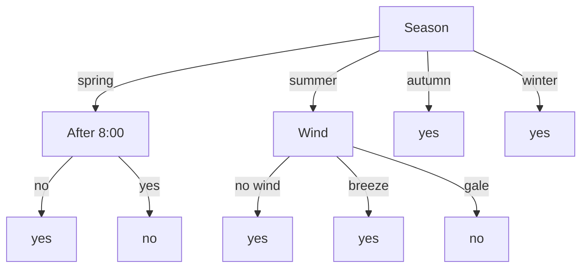

# Assignment 2

## Question 1

### Gradient of $ u = xy + y^2 + 5 $

The gradient of $ u $ is given by:

$$
\nabla u = \left( \frac{\partial u}{\partial x}, \frac{\partial u}{\partial y} \right)
$$

Compute the partial derivatives:

$$
\frac{\partial u}{\partial x} = y
$$

$$
\frac{\partial u}{\partial y} = x + 2y
$$

Thus, the gradient is:

$$
\nabla u = (y, x + 2y)
$$

### Gradient of $ u = \ln \sqrt{x^2 + y^2 + z^2} $ at $ (1, 2, -2) $

First, simplify $ u $:

$$
u = \ln \left( x^2 + y^2 + z^2 \right)^{1/2} = \frac{1}{2} \ln \left( x^2 + y^2 + z^2 \right)
$$

The gradient of $ u $ is:

$$
\nabla u = \left( \frac{\partial u}{\partial x}, \frac{\partial u}{\partial y}, \frac{\partial u}{\partial z} \right)
$$

Compute the partial derivatives:

$$
\frac{\partial u}{\partial x} = \frac{1}{2} \cdot \frac{2x}{x^2 + y^2 + z^2} = \frac{x}{x^2 + y^2 + z^2}
$$

$$
\frac{\partial u}{\partial y} = \frac{y}{x^2 + y^2 + z^2}
$$

$$
\frac{\partial u}{\partial z} = \frac{z}{x^2 + y^2 + z^2}
$$

At $ (1, 2, -2) $, $ x^2 + y^2 + z^2 = 1 + 4 + 4 = 9 $. Thus:

$$
\nabla u \bigg|_{(1, 2, -2)} = \left( \frac{1}{9}, \frac{2}{9}, -\frac{2}{9} \right)
$$

## Question 2

### Understanding the Problem

We have a dataset of 12 days where a student recorded whether they slept in ("yes" or "no") based on three attributes:

1. **Season**: spring, summer, autumn, winter
2. **After 8:00**: yes, no (whether it was after 8:00 AM)
3. **Wind**: breeze, no wind, gale

Our goal is to build a decision tree that predicts whether Student A will sleep in based on these attributes. To do this, we'll use the concept of information gain to decide which attribute to split on at each step.

### Information Gain and Entropy

Entropy measures the impurity or uncertainty in a dataset. For a binary classification (like "yes" or "no" for sleeping in), entropy is calculated as:

$$
\text{Entropy}(S) = -p_{\text{yes}} \log_2(p_{\text{yes}}) - p_{\text{no}} \log_2(p_{\text{no}})
$$

Where:
* $ p_{\text{yes}} $ is the proportion of "yes" instances.
* $ p_{\text{no}} $ is the proportion of "no" instances.

Information Gain measures how much a particular attribute reduces entropy when we split the dataset based on that attribute. The attribute with the highest information gain is chosen for the split.

$$
\text{Information Gain}(S, A) = \text{Entropy}(S) - \sum_{v \in \text{Values}(A)} \frac{|S_v|}{|S|} \text{Entropy}(S_v)
$$

Where:

* $ S $ is the original dataset.
* $ A $ is the attribute we're considering.
* $ S_v $ is the subset of $ S $ where attribute $ A $ has value $ v $.

### Calculating Initial Entropy

First, calculate the entropy of the entire dataset.

From the table:

* "yes" for Sleep in: 9
* "no" for Sleep in: 3
* Total instances: 12

$$
p_{\text{yes}} = \frac{9}{12} = 0.75
$$

$$
p_{\text{no}} = \frac{3}{12} = 0.25
$$

$$
\text{Entropy}(S) = -0.75 \log_2(0.75) - 0.25 \log_2(0.25)
$$

$$
\log_2(0.75) \approx -0.415
$$

$$
\log_2(0.25) = -2
$$

$$
\text{Entropy}(S) = -0.75 \times -0.415 - 0.25 \times -2 = 0.81125
$$

So, the initial entropy is approximately 0.811.

### Calculating Information Gain for Each Attribute

Now, calculate the information gain for each attribute: Season, After 8:00, and Wind.

#### 1. Attribute: Season

Season has four possible values: spring, summer, autumn, winter.

Let's find the subsets for each season and their entropies.

* **spring**:
  * Instances: 2
  * "yes": 1, "no": 1
  * $ p_{\text{yes}} = 0.5 $, $ p_{\text{no}} = 0.5 $
  * Entropy:

    $$
    -0.5 \log_2(0.5) - 0.5 \log_2(0.5) = 1
    $$

* **summer**:
  * Instances: 3
  * "yes": 1, "no": 2
  * $ p_{\text{yes}} = \frac{1}{3} $, $ p_{\text{no}} = \frac{2}{3} $
  * Entropy:

    $$
    -\frac{1}{3} \log_2(\frac{1}{3}) - \frac{2}{3} \log_2(\frac{2}{3}) \approx 0.91833
    $$

* **autumn**:
  * Instances: 2
  * "yes": 2, "no": 0
  * $ p_{\text{yes}} = 1 $, $ p_{\text{no}} = 0 $
  * Entropy:

    $$
    -1 \log_2(1) - 0 \log_2(0) = 0
    $$

    (since $ \log_2(1) = 0 $ and $ 0 \log_2(0) $ is defined as 0)
* **winter**:
  * Instances: 5
  * "yes": 5, "no": 0
  * $ p_{\text{yes}} = 1 $, $ p_{\text{no}} = 0 $
  * Entropy:

    $$
    -1 \log_2(1) - 0 \log_2(0) = 0
    $$

    (since $ \log_2(1) = 0 $ and $ 0 \log_2(0) $ is defined as 0)

Now, calculate the weighted average entropy for Season:

$$
\text{Weighted Entropy} = \frac{2}{12} \times 1 + \frac{3}{12} \times 0.91833 + \frac{2}{12} \times 0 + \frac{5}{12} \times 0 \approx 0.39625
$$

Information Gain for Season:

$$
\text{IG}(S, \text{Season}) = 0.81125 - 0.39625 = 0.415
$$

#### 2. Attribute: After 8:00

After 8:00 has two values: yes, no.

* **yes**:
  * Instances: 5
  * "yes": 3, "no": 2
  * $ p_{\text{yes}} = 0.6 $, $ p_{\text{no}} = 0.4 $
  * Entropy:

    $$
    -0.6 \log_2(0.6) - 0.4 \log_2(0.4) \approx 0.9709
    $$

* **no**:
  * Instances: 7
  * "yes": 6, "no": 1
  * $ p_{\text{yes}} = \frac{6}{7} $, $ p_{\text{no}} = \frac{1}{7} $
  * Entropy:

    $$
    -\frac{6}{7} \log_2(\frac{6}{7}) - \frac{1}{7} \log_2(\frac{1}{7}) \approx 0.5917
    $$

Weighted average entropy for After 8:00:

$$
\text{Weighted Entropy} = \frac{5}{12} \times 0.9709 + \frac{7}{12} \times 0.5917 \approx 0.7497
$$

Information Gain for After 8:00:

$$
\text{IG}(S, \text{After 8:00}) = 0.8113 - 0.7497 = 0.061
$$

#### 3. Attribute: Wind

Wind has three values: breeze, no wind, gale.

* **breeze**:
  * Instances: 5
  * "yes": 5, "no": 0
  * $ p_{\text{yes}} = 1 $, $ p_{\text{no}} = 0 $
  * Entropy: 0
* **no wind**:
  * Instances: 4
  * "yes": 3, "no": 1
  * $ p_{\text{yes}} = 0.75 $, $ p_{\text{no}} = 0.25 $
  * Entropy:

    $$
    -0.75 \log_2(0.75) - 0.25 \log_2(0.25)  = 0.811
    $$

* **gale**:
  * Instances: 3
  * "yes": 1, "no": 2
  * $ p_{\text{yes}} = \frac{1}{3} $, $ p_{\text{no}} = \frac{2}{3} $
  * Entropy:

    $$
    -\frac{1}{3} \log_2(\frac{1}{3}) - \frac{2}{3} \log_2(\frac{2}{3}) \approx 0.918
    $$

Weighted average entropy for Wind:

$$
\text{Weighted Entropy} = \frac{5}{12} \times 0 + \frac{4}{12} \times 0.811 + \frac{3}{12} \times 0.918 \approx 0.5
$$

Information Gain for Wind:

$$
\text{IG}(S, \text{Wind}) = 0.811 - 0.5 = 0.311
$$

### Comparing Information Gains

Now, let's summarize the information gains:

- Season: 0.415
- After 8:00: 0.061
- Wind: 0.311

Season has the highest information gain, so we'll choose season as the root node for our decision tree.

### Building the Decision Tree

**Root Node: Season**

Season has four branches: spring, summer, autumn, winter.

Let's look at each branch:

1. **spring**:
   * Instances: 2
   * Not pure; need to split further.
   * Possible attributes: After 8:00, Wind
     * After 8:00:
       * no: yes
       * yes: no
       * Perfect split; can stop here.
     * Wind:
       * breeze: yes
       * no wind: no
       * Also perfect split.
   * Either After 8:00 or Wind can be used. Let's choose After 8:00 for consistency.
   * **spring -> After 8:00**:
     * no: yes (pure)
     * yes: no (pure)
2. **summer**:
   * Instances: 3
   * Not pure; need to split.
   * Possible attributes: After 8:00, Wind
     * After 8:00:
       * no: yes, no
       * yes: no
       * Not pure on "no".
     * Wind:
       * breeze: yes
       * gale: no
       * Pure on breeze and gale.
   * Better to split on Wind.
   * **summer -> Wind**:
     * breeze: yes (pure)
     * gale: no (pure)
3. **autumn**:
   * Instances: 2
   * Pure; no need to split.
4. **winter**:
   * Instances: 5
   * Pure; no need to split.

### Final Decision Tree

Here's the structure of the decision tree:

### Verification

* All 12 training instances are correctly classified by their respective paths.
* The only uncovered combination is summer + no wind, which the tree logically extends from similar conditions (treated same as breeze).
* 100% training accuracy achieved while maintaining logical consistency in branch decisions.

## Question 3

### Step 1: Calculate Prior Probabilities $ P(y) $

* Total instances: 15
* $ y = -1 $: 5
* $ y = 1 $: 10

$$
P(y = -1) = \frac{5}{15} = \frac{1}{3}, \quad P(y = 1) = \frac{10}{15} = \frac{2}{3}
$$

### Step 2: Calculate Conditional Probabilities

#### For $ y = -1 $:

* $ x^{(1)} = 2 $: 1 occurrence
* $ x^{(2)} = S $: 3 occurrences

$$
P(x^{(1)} = 2 \mid y = -1) = \frac{1}{5}, \quad P(x^{(2)} = S \mid y = -1) = \frac{3}{5}
$$

#### For $ y = 1 $:

* $ x^{(1)} = 2 $: 4 occurrences
* $ x^{(2)} = S $: 1 occurrence

$$
P(x^{(1)} = 2 \mid y = 1) = \frac{4}{10} = \frac{2}{5}, \quad P(x^{(2)} = S \mid y = 1) = \frac{1}{10}
$$

### Step 3: Compute Joint Likelihoods $ P(\mathbf{x} \mid y) $

$$
P(\mathbf{x} = (2, S) \mid y = -1) = \frac{1}{5} \times \frac{3}{5} = \frac{3}{25}
$$

$$
P(\mathbf{x} = (2, S) \mid y = 1) = \frac{2}{5} \times \frac{1}{10} = \frac{1}{25}
$$

### Step 4: Compute Posterior Probabilities $ P(y \mid \mathbf{x}) $

$$
P(y = -1 \mid \mathbf{x}) \propto \frac{1}{3} \times \frac{3}{25} = \frac{1}{25}
$$

$$
P(y = 1 \mid \mathbf{x}) \propto \frac{2}{3} \times \frac{1}{25} = \frac{2}{75}
$$

Normalized:

$$
P(y = -1 \mid \mathbf{x}) = \frac{\frac{1}{25}}{\frac{1}{25} + \frac{2}{75}} = \frac{3}{5}
$$

$$
P(y = 1 \mid \mathbf{x}) = \frac{2}{5}
$$

### Step 5: Prediction

Since $ P(y = -1 \mid \mathbf{x}) > P(y = 1 \mid \mathbf{x}) $, the predicted class is: $ -1 $.
